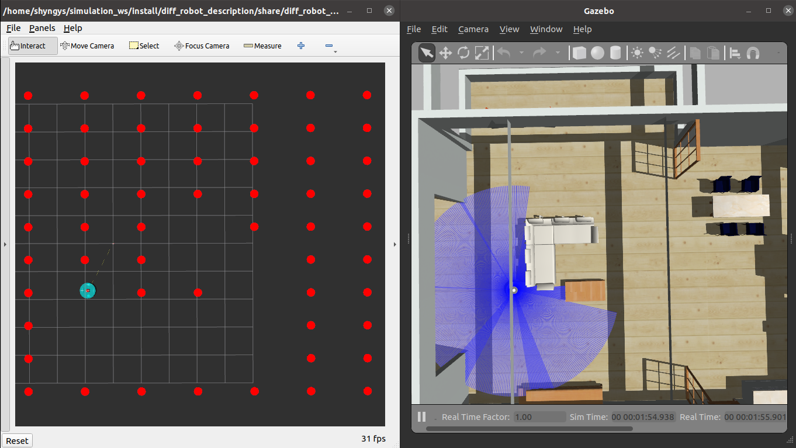

`diff_robot_description` package is for simulation of circular differential drive robot in Gazebo simulator. 
`diff_robot_control` package is for dust particle generation and gathering logic.

### Whole simulation environment
Command for launching robot simulation, dust publisher, and Evolutionary Algorithm controller:
```
ros2 launch diff_robot_control EA_control.launch.py
```

### Simulation
Command for launching robot simulation:
```
ros2 launch diff_robot_description display.launch.py
```

### Teleoperation
1. Command for teleoperating robot via forward/backward/left/right arrow keys:
    ```
    ros2 run teleop_twist_keyboard teleop_twist_keyboard
    ```
2. Command for teleoperating robot via separate velocity keys:
    ``` 
    ros2 run diff_robot_control velocity_teleop 
    ```
3. Command for EA:
    ```
    ros2 run diff_robot_control velocity_evolutionary_algorithm
    ```
### Dust visualization
Command for starting dust visualization and gathering logic:
```
ros2 run diff_robot_control dust_particles_node
```

The RViZ window with dust information along with robot model simulated in Gazebo can be seen below.
